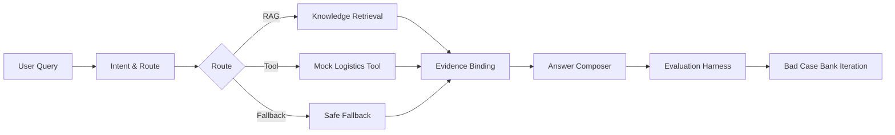

# CustomerOpsAgent: Cross-Border Customer Support Agent With RAG Evaluation

Chinese version: [README.md](./README.md)


> **CustomerOpsAgent is a RAG + Agent demo for cross-border e-commerce customer support. Rather than being a simple chatbot, it builds a complete quality loop from knowledge base, retrieval, routing, answer generation, automated evaluation, to Bad Case iteration.**

## Live Demo

| Entry | URL |
|-------|-----|
| Frontend Demo | https://customer-ops-agent.vercel.app/ |
| Backend API | https://customeropsagent.onrender.com |
| API Docs | https://customeropsagent.onrender.com/docs |

> Render free instances may cold start — first visit may need 30–90 seconds.

## Quick Start

### Docker Compose (Recommended)

```bash
git clone https://github.com/Strange-Men/CustomerOpsAgent.git
cd CustomerOpsAgent
docker compose up -d
```

| Service | URL |
|---------|-----|
| Frontend | http://localhost:8080 |
| Backend API Docs | http://localhost:8000/docs |

- Default uses Mock mode, no real LLM key needed.
- Mimo real LLM configured via Render backend environment variables.
- Stop: `docker compose down`

### Local Development

Backend:

```bash
cd backend
pip install -r requirements.txt
PYTHONPATH=backend uvicorn app.main:app --host 127.0.0.1 --port 8000
```

Frontend:

```bash
cd frontend
npm install
npm run dev
```

## STAR Project Breakdown

### Situation

Cross-border customer support faces repetitive daily inquiries: customs delays, refund timelines, logistics tracking, payment failures, return/exchange policies. These share three characteristics:

1. **Scattered knowledge**. Policy documents, logistics rules, and refund processes are spread across different systems.
2. **Inconsistent replies**. Different agents explain the same issue differently.
3. **Hard to quantify quality**. Traditional solutions have no evaluation loop.

A plain chatbot produces untraceable free text — users can't see evidence, and developers can't explain why the system chose RAG, a tool, or fallback.

### Task

Build a **demoable, explainable, evaluable, and continuously optimizable** cross-border customer support Agent supporting:

- RAG retrieval with evidence binding
- Agent intent recognition and routing
- Mock tools and fallback rules
- Real LLM profile secure integration
- Automated evaluation and Bad Case iteration

### Action

| # | Action | Purpose |
|---|--------|---------|
| 1 | Layered knowledge base | 14 JSONL documents covering 12 scenarios, structured data source for RAG |
| 2 | RAG retrieval with evidence binding | Self-implemented BM25 + query expansion + metadata boost, answers backed by evidence |
| 3 | Agent intent recognition & routing | 11 intent categories + rule-driven disambiguation, auto-select RAG/tool/fallback path |
| 4 | Answer Composer | Structured template: conclusion → evidence → action suggestions, unified answer format |
| 5 | Evaluation Harness | Retrieval + answer + Bad Case evaluation, quantifying answer quality |
| 6 | Bad Case Bank iteration | 131 structured typical cases covering customs/refund/logistics/payment across 11 categories |
| 7 | Mimo real LLM secure integration | Profile-based model switching, frontend never touches keys, backend whitelist control |
| 8 | Docker Compose delivery | One-click frontend/backend startup, Render/Vercel deployment support |

### Result

| Metric | Before | After | Change |
|--------|-------:|------:|-------:|
| Answer Pass Rate | 46.72% | 60.66% | +13.94pp / ~30% relative |
| Citation Hit Rate | 83.61% | 95.90% | +12.29pp |
| Fallback Rate | 13.11% | 0.82% | -12.29pp |
| Recall@5 | — | 90.00% | top-5 retrieval hit |
| Bad Case Bank | — | 131 cases | 11 customer support scenarios |
| Bad Case Pass | — | 128/131 | 97.71% structural pass rate |
| pytest | — | 293 passed | Full backend test suite |
| Docker Compose | — | verified | Local one-click runtime |
| Mimo real LLM | — | verified | Real LLM profile validated |

## Why It Is Not Just Another Chatbot

1. **RAG evidence binding**: Answers based on knowledge base retrieval, not pure free generation.
2. **Evaluation Harness**: Multi-dimensional automated evaluation (retrieval, citation, answer, fallback), not just subjective experience.
3. **Bad Case Bank**: 131 structured typical cases for continuous optimization, not ad-hoc prompt tuning.
4. **Profile-based LLM Adapter**: Frontend sends only profile name, backend whitelist + environment variable resolution, no API key exposure.
5. **Engineering delivery form**: Docker Compose + Render + Vercel, runnable locally and deployable online.

## Architecture & Workflow



### Tech Stack

| Layer | Technology |
|-------|------------|
| Frontend | React 19 + TypeScript + Tailwind CSS |
| Backend | FastAPI + Python 3.11+ |
| RAG | Self-implemented BM25 + query expansion + metadata boost |
| LLM | Profile-based adapter (mock / deepseek / doubao / mimo) |
| Eval | Self-built Evaluation Harness (retrieval + answer + bad case) |
| Deploy | Docker Compose + Render + Vercel |

## Evaluation Results

### Three-Layer Evaluation System

| Layer | Tool | Metrics |
|-------|------|---------|
| Retrieval Eval | `retrieval_eval.py` | Recall@1/3/5, MRR |
| Answer Eval | `answer_eval.py` | Relevance, Groundedness, Completeness, Citation Hit Rate, Answer Pass Rate, Fallback Rate |
| Bad Case Eval | `bad_case_eval.py` | Structural Pass Rate, Citation Coverage, Fallback Rate |

### Bad Case Bank Coverage

| Scenario | Count | Description |
|----------|-------|-------------|
| logistics | 15 | Shipping, timelines, tracking |
| customs | 15 | Customs delays, inspections, duties |
| package | 15 | Damage, loss, claims |
| mixed | 15 | Multi-intent compound scenarios |
| payment | 10 | Payment failures, risk control |
| coupon | 10 | Coupon usage, expiration |
| exchange | 9 | Exchange process, timelines |
| address | 9 | Address modifications |
| out_of_scope | 9 | Out-of-scope questions |
| return | 8 | Return conditions, process |
| refund | 8 | Refund timelines, status |
| order | 8 | Order cancellation, coupon refund |

Reports: [docs/RAG_QUALITY_IMPROVEMENT_REPORT.md](docs/RAG_QUALITY_IMPROVEMENT_REPORT.md) · [docs/BAD_CASE_BANK_REPORT.md](docs/BAD_CASE_BANK_REPORT.md)

## Real LLM Profile

The system supports real LLM integration via backend environment variables. Mimo profile has been verified:

- `answer_source=real_llm`, `llm_model=mimo-v2.5-pro`
- Real key stored only in Render backend env vars; frontend sends only `llm_profile`
- Falls back to mock when real model is not configured
- Report: [docs/REAL_MIMO_SMOKE_REPORT.md](docs/REAL_MIMO_SMOKE_REPORT.md)

## API Example

```bash
curl -X POST "https://customeropsagent.onrender.com/api/agent/chat" \
  -H "Content-Type: application/json" \
  -d '{
    "user_query": "What to do about customs delays?",
    "order_id": null,
    "conversation_history": [],
    "llm_profile": "mock"
  }'
```

`llm_profile` options: mock / deepseek / doubao / mimo. Falls back to mock when real model is not configured. Do not send API keys in requests.

## Testing

```bash
# Backend tests
PYTHONPATH=backend pytest -v

# Code quality
ruff check backend/app/rag/schemas.py backend/app/rag/loader.py backend/app/rag/chunker.py backend/app/rag/retriever.py backend/app/rag/optimized_retriever.py backend/app/eval/retrieval_eval.py backend/app/eval/answer_eval.py backend/app/eval/bad_case_eval.py backend/app/eval/bad_case_schema.py backend/app/agent backend/app/api backend/app/llm backend/tests

# Frontend build
cd frontend && npm run build
```

Current results: pytest 293 passed, ruff All checks passed, frontend build passed, Docker Compose verified locally.

## FAQ

**Q: Why doesn't Docker use a real LLM key by default?**
A: For zero-barrier experience. Default Mock mode fully demonstrates RAG retrieval, Agent routing, answer generation, and evaluation flow without any external dependencies.

**Q: Why is Render slow on first visit?**
A: Render free instances have cold start. First visit may take 30-90 seconds. Subsequent visits are normal.

**Q: Where is the Mimo key stored?**
A: Only in Render backend environment variables. Frontend only sends the `llm_profile` name, never touching any API key.

**Q: Why can't the frontend configure API keys?**
A: Security design. API keys are backend-only, preventing key leakage from the frontend.

**Q: What's the difference between Mock and Mimo?**
A: Mock uses template-based answer generation, Mimo uses a real LLM. Both share the same RAG retrieval and Agent routing logic.

**Q: Why are RAG citations in a detail section instead of the answer body?**
A: To keep the answer concise while allowing users to expand and verify knowledge base evidence when needed.

**Q: What is the Bad Case Bank?**
A: 131 structured typical customer support scenarios for automated answer quality evaluation and continuous optimization.

**Q: How to run the evaluation script?**
A: `PYTHONPATH=backend pytest backend/tests/test_answer_eval.py -v`

**Q: What if Docker ports are occupied?**
A: Modify port mappings in `docker-compose.yml`, or stop the services occupying those ports.

## Glossary

| Term | Description |
|------|-------------|
| RAG | Retrieval-Augmented Generation, generates answers based on knowledge base retrieval results |
| Recall@5 | Top-5 retrieval hit rate, measures retrieval quality |
| MRR | Mean Reciprocal Rank, measures retrieval ranking quality |
| Citation Hit Rate | Whether the answer contains knowledge base evidence |
| Fallback Rate | Ratio of degraded generic responses when the system cannot give a valid answer |
| Bad Case Bank | Structured typical case library for automated evaluation and iteration |
| LLM Profile | Model configuration identifier, frontend sends name only, backend resolves to specific model and key |
| Answer Composer | Answer generator, assembles retrieval results and intent info into structured answers |

## Milestones

| Version | Status | Description |
|---------|--------|-------------|
| v1.4.0-badcase | ✅ | 131 Bad Case Bank + evaluation harness |
| v1.4.1-real-mimo | ✅ | Mimo real LLM profile verified |
| v1.5.0-docker | ✅ | Docker Compose local runtime |
| v1.6.0-final-docs | ✅ | Final docs and delivery summary |
| v1.6.1-final-polish | ✅ | UI answer display polish |
| v1.6.2-readme-ui-polish | ✅ | Markdown rendering fix + README structure optimization |

Optional next:

- Expand knowledge base document scale
- Connect real logistics tool API
- Case-level before/after tracking
- Multilingual knowledge base migration

## Security Boundaries

- No LLM API key is stored in the frontend.
- The frontend sends only `llm_profile`; the backend restricts profiles through a whitelist.
- Missing real model configuration falls back to mock.
- No real logistics API is connected — uses mock logistics tool.
- No real order system is connected.
- `.env` is not committed to Git; real keys are configured via Render environment variables only.

## Project Structure

```text
CustomerOpsAgent/
├── backend/
│   └── app/
│       ├── agent/          # Agent Workflow (intent, route, fallback, answer)
│       ├── api/            # FastAPI API endpoint
│       ├── eval/           # Evaluation Harness (retrieval, answer, bad case)
│       ├── llm/            # LLM Adapter (mock, openai-compatible)
│       └── rag/            # RAG (schemas, loader, chunker, retriever)
├── frontend/
│   └── src/
│       ├── components/     # React components
│       ├── data/           # Sample data
│       └── lib/            # API client, types, constants
├── docs/                   # Project documentation
├── docker-compose.yml      # Docker Compose config
├── README.md
└── README.en.md
```
