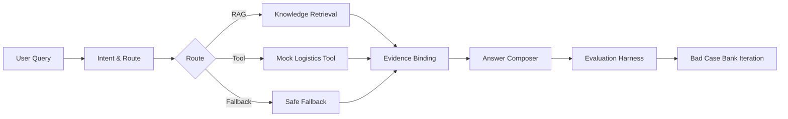

# CustomerOpsAgent｜跨境电商客服 Agent 与 RAG 质量评估增强

English version: [README.en.md](./README.en.md)


> **CustomerOpsAgent 是一个面向跨境电商客服场景的 RAG + Agent Demo，重点不是普通聊天，而是构建从知识库、检索、路由、回答生成、自动化评测到 Bad Case 迭代的完整质量闭环。**

## 在线体验

| 入口 | 地址 |
|------|------|
| 前端 Demo | https://customer-ops-agent.vercel.app/ |
| 后端 API | https://customeropsagent.onrender.com |
| API Docs | https://customeropsagent.onrender.com/docs |

> Render 免费实例可能冷启动，首次访问需等待 30–90 秒。

## Quick Start

### Docker Compose（推荐）

```bash
git clone https://github.com/Strange-Men/CustomerOpsAgent.git
cd CustomerOpsAgent
docker compose up -d
```

| 服务 | 地址 |
|------|------|
| Frontend | http://localhost:8080 |
| Backend API Docs | http://localhost:8000/docs |

- 默认使用 Mock 模式，无需真实 LLM key。
- Mimo 真实 LLM 通过 Render 后端环境变量配置。
- 停止服务：`docker compose down`

### 本地开发

后端：

```bash
cd backend
pip install -r requirements.txt
PYTHONPATH=backend uvicorn app.main:app --host 127.0.0.1 --port 8000
```

前端：

```bash
cd frontend
npm install
npm run dev
```

## STAR Project Breakdown

### Situation：业务情境

跨境电商客服每天面对大量重复性咨询：清关延迟、退款到账、物流追踪、支付失败、退换货政策等。这些问题有三个共同特征：

1. **知识分散**。政策文档、物流规则、退款流程散落在不同系统中。
2. **回复口径不统一**。不同客服对同一问题的解释方式不同。
3. **效果难量化**。传统方案没有评测闭环，无法回答"优化后到底好了多少"。

如果只做一个普通聊天机器人，回答会变成不可追溯的自由文本——用户看不到证据来源，开发者也无法复盘系统为什么走 RAG、工具或 fallback。

### Task：核心任务

构建一个**可演示、可解释、可评估、可持续优化**的跨境电商客服 Agent，支持：

- RAG 检索与证据绑定
- Agent 意图识别与路由
- Mock 工具与兜底规则
- 真实 LLM profile 安全接入
- 自动化评测与 Bad Case 迭代

### Action：关键行动

| # | 行动 | 目的 |
|---|------|------|
| 1 | 分层知识库建设 | 14 条 JSONL 知识文档，覆盖 12 个客服场景，为 RAG 提供结构化数据源 |
| 2 | RAG 检索与证据绑定 | 自实现 BM25 + query expansion + metadata boost，确保回答有据可查 |
| 3 | Agent 意图识别与路由 | 11 个意图分类 + 规则驱动消歧，自动选择 RAG/工具/fallback 路径 |
| 4 | Answer Composer 回答生成 | 结构化模板：结论 → 依据 → 操作建议，统一回答口径 |
| 5 | Evaluation Harness 自动化评测 | 检索评测 + 回答评测 + Bad Case 评测，量化回答质量 |
| 6 | Bad Case Bank 迭代 | 131 条典型客服场景，覆盖清关/退款/物流/支付等 11 类问题 |
| 7 | Mimo 真实 LLM 安全接入 | Profile-based 模型切换，前端不接触密钥，后端白名单控制 |
| 8 | Docker Compose 工程交付 | 一键启动前后端，支持 Render/Vercel 线上部署 |

### Result：量化结果

| Metric | Before | After | Change |
|--------|-------:|------:|-------:|
| Answer Pass Rate | 46.72% | 60.66% | +13.94pp / ~30% relative |
| Citation Hit Rate | 83.61% | 95.90% | +12.29pp |
| Fallback Rate | 13.11% | 0.82% | -12.29pp |
| Recall@5 | — | 90.00% | top-5 检索命中 |
| Bad Case Bank | — | 131 条 | 覆盖 11 个客服场景 |
| Bad Case Pass | — | 128/131 | 结构性通过率 97.71% |
| pytest | — | 293 passed | 后端全量测试 |
| Docker Compose | — | verified | 本地一键运行 |
| Mimo real LLM | — | verified | 真实 LLM profile 已验证 |

## Why It Is Not Just Another Chatbot

1. **有 RAG 证据绑定**：回答基于知识库检索，不是纯自由生成。
2. **有 Evaluation Harness**：从检索、引用、回答、fallback 多维度自动化评测，不是只靠主观体验。
3. **有 Bad Case Bank**：131 条结构化典型问题，持续迭代优化，不是临时调 Prompt。
4. **有 Profile-based LLM Adapter**：前端只传 profile 名，后端白名单 + 环境变量解析，不暴露 API key。
5. **有工程交付形态**：Docker Compose + Render + Vercel，可本地运行也可线上部署。

## 技术架构与工作流



### 技术栈

| 层级 | 技术 |
|------|------|
| Frontend | React 19 + TypeScript + Tailwind CSS |
| Backend | FastAPI + Python 3.11+ |
| RAG | 自实现 BM25 + query expansion + metadata boost |
| LLM | Profile-based adapter (mock / deepseek / doubao / mimo) |
| Eval | 自建 Evaluation Harness (retrieval + answer + bad case) |
| Deploy | Docker Compose + Render + Vercel |

## 质量评测结果

### 评测体系三层结构

| 层级 | 工具 | 指标 |
|------|------|------|
| 检索评测 | `retrieval_eval.py` | Recall@1/3/5, MRR |
| 回答评测 | `answer_eval.py` | Relevance, Groundedness, Completeness, Citation Hit Rate, Answer Pass Rate, Fallback Rate |
| Bad Case 评测 | `bad_case_eval.py` | Structural Pass Rate, Citation Coverage, Fallback Rate |

### Bad Case Bank 场景覆盖

| 场景 | 数量 | 说明 |
|------|------|------|
| logistics | 15 | 物流配送、时效、追踪 |
| customs | 15 | 清关延迟、海关抽检、关税 |
| package | 15 | 包裹破损、丢失、理赔 |
| mixed | 15 | 多意图复合场景 |
| payment | 10 | 支付失败、风控 |
| coupon | 10 | 优惠券使用、过期 |
| exchange | 9 | 换货流程、时效 |
| address | 9 | 地址修改 |
| out_of_scope | 9 | 超出服务范围 |
| return | 8 | 退货条件、流程 |
| refund | 8 | 退款时间、到账 |
| order | 8 | 订单取消、优惠券退回 |

详细报告：[docs/RAG_QUALITY_IMPROVEMENT_REPORT.md](docs/RAG_QUALITY_IMPROVEMENT_REPORT.md) · [docs/BAD_CASE_BANK_REPORT.md](docs/BAD_CASE_BANK_REPORT.md)

## 真实 LLM 与安全模型切换

系统支持通过后端环境变量配置真实 LLM，已验证 Mimo 真实 profile：

- `answer_source=real_llm`，`llm_model=mimo-v2.5-pro`
- 真实 key 仅保存在 Render 后端环境变量，前端只传 `llm_profile`
- 未配置真实模型时自动 fallback 到 mock
- 详细报告：[docs/REAL_MIMO_SMOKE_REPORT.md](docs/REAL_MIMO_SMOKE_REPORT.md)

## API 示例

```bash
curl -X POST "https://customeropsagent.onrender.com/api/agent/chat" \
  -H "Content-Type: application/json" \
  -d '{
    "user_query": "清关延迟怎么办？",
    "order_id": null,
    "conversation_history": [],
    "llm_profile": "mock"
  }'
```

`llm_profile` 可选：mock / deepseek / doubao / mimo。未配置真实模型时自动 fallback mock。不要在请求中传 API key。

## 测试与评估

```bash
# 后端测试
PYTHONPATH=backend pytest -v

# 代码质量
ruff check backend/app/rag/schemas.py backend/app/rag/loader.py backend/app/rag/chunker.py backend/app/rag/retriever.py backend/app/rag/optimized_retriever.py backend/app/eval/retrieval_eval.py backend/app/eval/answer_eval.py backend/app/eval/bad_case_eval.py backend/app/eval/bad_case_schema.py backend/app/agent backend/app/api backend/app/llm backend/tests

# 前端构建
cd frontend && npm run build
```

当前验证结果：

- pytest：293 passed
- ruff：All checks passed
- frontend build：passed
- Docker Compose：本地验证通过

## FAQ

**Q: 为什么 Docker 默认不用真实 LLM key？**
A: 为了零门槛体验。默认 Mock 模式可以完整演示 RAG 检索、Agent 路由、回答生成和评测流程，无需任何外部依赖。

**Q: Render 第一次访问为什么慢？**
A: Render 免费实例有冷启动机制，首次访问需等待 30-90 秒。后续访问正常。

**Q: Mimo key 放在哪里？**
A: 只放在 Render 后端环境变量中。前端只传 `llm_profile` 名称，不接触任何 API key。

**Q: 为什么前端不能配置 API key？**
A: 安全设计。API key 只在后端，前端无法泄露密钥。

**Q: Mock 和 Mimo 有什么区别？**
A: Mock 使用模板生成回答，Mimo 使用真实大语言模型。两者共享相同的 RAG 检索和 Agent 路由逻辑。

**Q: RAG citations 为什么放在详情区而不是回答正文？**
A: 保持回答正文简洁，同时让需要验证的用户可以展开查看知识库依据。

**Q: Bad Case Bank 是什么？**
A: 131 条结构化典型客服场景，用于自动化评测回答质量，驱动持续优化。

**Q: 如何运行评测脚本？**
A: `PYTHONPATH=backend pytest backend/tests/test_answer_eval.py -v`

**Q: Docker 端口被占用怎么办？**
A: 修改 `docker-compose.yml` 中的端口映射，或停止占用端口的服务。

## 术语表

| 术语 | 说明 |
|------|------|
| RAG | Retrieval-Augmented Generation，检索增强生成，基于知识库检索结果生成回答 |
| Recall@5 | top-5 检索命中率，衡量检索质量 |
| MRR | Mean Reciprocal Rank，平均倒数排名，衡量检索排序质量 |
| Citation Hit Rate | 引用命中率，回答中是否包含知识库依据 |
| Fallback Rate | 兜底率，系统无法给出有效回答时降级到通用回复的比例 |
| Bad Case Bank | 结构化典型问题库，用于自动化评测和迭代优化 |
| LLM Profile | 模型配置标识，前端只传名称，后端解析为具体模型和 key |
| Answer Composer | 回答生成器，将检索结果和意图信息组装成结构化回答 |

## Roadmap / Milestones

| 版本 | 状态 | 说明 |
|------|------|------|
| v1.4.0-badcase | ✅ | 131 条 Bad Case Bank + evaluation harness |
| v1.4.1-real-mimo | ✅ | Mimo 真实 LLM profile 验证通过 |
| v1.5.0-docker | ✅ | Docker Compose 本地一键运行 |
| v1.6.0-final-docs | ✅ | 最终文档收口 |
| v1.6.1-final-polish | ✅ | UI 回答展示优化 |
| v1.6.2-readme-ui-polish | ✅ | Markdown 渲染修复 + README 结构优化 |

可选后续：

- 扩大知识库文档规模
- 接入真实物流工具 API
- case-level before/after 追踪
- 多语言知识库迁移

## 安全边界

- 前端不保存、不输入、不传递任何 LLM API key。
- 前端只传 `llm_profile`，后端白名单限制 profile。
- 未配置真实模型时自动 fallback mock。
- 当前未接真实物流 API，使用 mock logistics tool 模拟。
- 当前未接真实订单系统。
- `.env` 不提交 Git，真实 key 仅通过 Render 环境变量配置。

## 项目目录

```text
CustomerOpsAgent/
├── backend/
│   └── app/
│       ├── agent/          # Agent Workflow（intent, route, fallback, answer）
│       ├── api/            # FastAPI API endpoint
│       ├── eval/           # Evaluation Harness（retrieval, answer, bad case）
│       ├── llm/            # LLM Adapter（mock, openai-compatible）
│       └── rag/            # RAG（schemas, loader, chunker, retriever）
├── frontend/
│   └── src/
│       ├── components/     # React 组件
│       ├── data/           # 示例数据
│       └── lib/            # API client, types, constants
├── docs/                   # 项目文档
├── docker-compose.yml      # Docker Compose 配置
├── README.md
└── README.en.md
```
