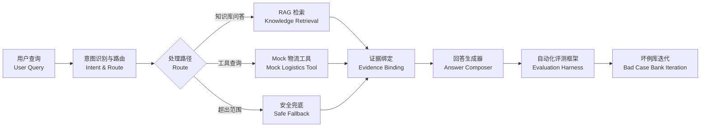

# CustomerOpsAgent｜跨境电商客服智能体与 RAG 质量评估增强

English version: [README.en.md](./README.en.md)


> **CustomerOpsAgent 是一个面向跨境电商客服场景的 RAG（检索增强生成）+ Agent（智能体）Demo，重点不是普通聊天，而是构建从知识库、检索、路由、回答生成、自动化评测到坏例迭代的完整质量闭环。**

## 在线体验

| 入口 | 地址 |
|------|------|
| 前端 Demo | https://customer-ops-agent.vercel.app/ |
| 后端 API | https://customeropsagent.onrender.com |
| API Docs | https://customeropsagent.onrender.com/docs |

> Render 免费实例可能冷启动，首次访问需等待 30–90 秒。

## 快速上手（Quick Start）

### Docker Compose（推荐）

```bash
git clone https://github.com/Strange-Men/CustomerOpsAgent.git
cd CustomerOpsAgent
docker compose up -d
```

| 服务 | 地址 |
|------|------|
| 前端 | http://localhost:8080 |
| 后端 API Docs | http://localhost:8000/docs |

- 默认使用 Mock 模式，无需真实大语言模型（LLM）key。
- Mimo 真实 LLM 通过 Render 后端环境变量配置。
- 停止服务：`docker compose down`

### 本地开发

后端：

```bash
cd backend
pip install -r requirements.txt
PYTHONPATH=backend uvicorn app.main:app --host 127.0.0.1 --port 8000
```

前端：

```bash
cd frontend
npm install
npm run dev
```

## STAR 项目拆解（Situation / Task / Action / Result）

### Situation：业务情境

跨境电商客服面临知识分散、回复口径不统一、服务质量难量化的问题。普通聊天机器人虽然能回答问题，但难以证明回答是否准确、是否有依据、是否能持续优化。

具体表现为：

1. **知识分散**。政策文档、物流规则、退款流程散落在不同系统中。
2. **回复口径不统一**。不同客服对同一问题的解释方式不同。
3. **效果难量化**。传统方案没有评测闭环，无法回答"优化后到底好了多少"。

### Task：核心任务

构建一个**可演示、可解释、可评估、可持续优化**的跨境电商客服智能体（Agent），解决知识检索、意图路由、回答生成、自动化评测和坏例迭代的完整链路问题。

### Action：关键行动

| # | 行动 | 目的 |
|---|------|------|
| 1 | 分层知识库建设 | 14 条 JSONL 知识文档，覆盖 12 个客服场景，为 RAG 提供结构化数据源 |
| 2 | RAG（检索增强生成）检索与证据绑定 | 自实现 BM25（最佳匹配 25 算法）+ 查询扩展（Query Expansion）+ 元数据加权，确保回答有据可查 |
| 3 | Agent（智能体）意图识别与路由 | 11 个意图分类 + 规则驱动消歧，自动选择 RAG / 工具 / 兜底路径 |
| 4 | 回答生成器（Answer Composer） | 结构化模板：结论 → 依据 → 操作建议，统一回答口径 |
| 5 | 自动化评测框架（Evaluation Harness） | 检索评测 + 回答评测 + 坏例评测，量化回答质量 |
| 6 | 坏例库（Bad Case Bank）迭代 | 131 条典型客服场景，覆盖清关 / 退款 / 物流 / 支付等 11 类问题 |
| 7 | Mimo 真实大语言模型（LLM）安全接入 | 基于模型配置标识（Profile）的安全模型切换，前端不接触密钥，后端白名单控制 |
| 8 | Docker Compose 工程化交付 | 一键启动前后端，支持 Render / Vercel 线上部署 |

### Result：量化结果

| 指标 | 优化前 | 优化后 | 变化 |
|------|-------:|------:|-----:|
| 回答合格率（Answer Pass Rate） | 46.72% | 60.66% | +13.94pp / 相对提升约 30% |
| 引用命中率（Citation Hit Rate） | 83.61% | 95.90% | +12.29pp |
| 兜底率（Fallback Rate） | 13.11% | 0.82% | -12.29pp |
| Top-5 检索召回率（Recall@5） | — | 90.00% | 达到 85%+ 目标 |
| 坏例库（Bad Case Bank） | — | 131 条 | 覆盖 11 个客服场景 |
| 坏例结构性通过 | — | 128/131 | 结构性通过率 97.71% |
| pytest | — | 293 passed | 后端全量测试 |
| Docker Compose | — | 验证通过 | 本地一键运行 |
| Mimo 真实 LLM Profile | — | 验证通过 | 真实 LLM 模型配置已验证 |

> 注：pp 表示百分点（percentage points），"相对提升约 30%"指从 46.72% 提升到 60.66%，绝对值提升 13.94 个百分点。

## 为什么它不是普通客服聊天机器人

1. **有 RAG 证据绑定**：回答基于知识库检索，不是纯自由生成。
2. **有自动化评测框架（Evaluation Harness）**：从检索、引用、回答、兜底多维度自动化评测，不是只靠主观体验。
3. **有坏例库（Bad Case Bank）**：131 条结构化典型问题，持续迭代优化，不是临时调整提示词（Prompt）。
4. **有基于模型配置标识（Profile）的 LLM 适配器**：前端只传 Profile 名称，后端白名单 + 环境变量解析，不暴露 API key。
5. **有工程交付形态**：Docker Compose + Render + Vercel，可本地运行也可线上部署。

## 技术架构与工作流



### 技术栈

| 层级 | 技术 |
|------|------|
| 前端 | React 19 + TypeScript + Tailwind CSS |
| 后端 | FastAPI + Python 3.11+ |
| RAG 检索 | 自实现 BM25 + 查询扩展（Query Expansion）+ 元数据加权 |
| LLM 适配器 | 基于 Profile 的适配器（mock / deepseek / doubao / mimo） |
| 评测 | 自建自动化评测框架（检索评测 + 回答评测 + 坏例评测） |
| 部署 | Docker Compose + Render + Vercel |

## 质量评测结果

### 评测体系三层结构

| 层级 | 工具 | 指标 |
|------|------|------|
| 检索评测 | `retrieval_eval.py` | Recall@1/3/5, MRR（平均倒数排名） |
| 回答评测 | `answer_eval.py` | 相关性、有据性、完整性、引用命中率、回答合格率、兜底率 |
| 坏例评测 | `bad_case_eval.py` | 结构性通过率、引用覆盖率、兜底率 |

### 坏例库（Bad Case Bank）场景覆盖

| 场景 | 数量 | 说明 |
|------|------|------|
| logistics | 15 | 物流配送、时效、追踪 |
| customs | 15 | 清关延迟、海关抽检、关税 |
| package | 15 | 包裹破损、丢失、理赔 |
| mixed | 15 | 多意图复合场景 |
| payment | 10 | 支付失败、风控 |
| coupon | 10 | 优惠券使用、过期 |
| exchange | 9 | 换货流程、时效 |
| address | 9 | 地址修改 |
| out_of_scope | 9 | 超出服务范围 |
| return | 8 | 退货条件、流程 |
| refund | 8 | 退款时间、到账 |
| order | 8 | 订单取消、优惠券退回 |

详细报告：[docs/RAG_QUALITY_IMPROVEMENT_REPORT.md](docs/RAG_QUALITY_IMPROVEMENT_REPORT.md)（RAG 质量优化报告）· [docs/BAD_CASE_BANK_REPORT.md](docs/BAD_CASE_BANK_REPORT.md)（坏例库统计与优化报告）

## 真实 LLM 与安全模型切换

系统支持通过后端环境变量配置真实大语言模型（LLM），已验证 Mimo 真实模型配置标识（Profile）：

- `answer_source=real_llm`，`llm_model=mimo-v2.5-pro`
- 真实 key 仅保存在 Render 后端环境变量，前端只传 `llm_profile`（LLM 配置标识参数）
- 未配置真实模型时自动兜底到 Mock 模式
- 详细报告：[docs/REAL_MIMO_SMOKE_REPORT.md](docs/REAL_MIMO_SMOKE_REPORT.md)（Mimo 真实 LLM 验证报告）

## API 示例

```bash
curl -X POST "https://customeropsagent.onrender.com/api/agent/chat" \
  -H "Content-Type: application/json" \
  -d '{
    "user_query": "清关延迟怎么办？",
    "order_id": null,
    "conversation_history": [],
    "llm_profile": "mock"
  }'
```

`llm_profile`（LLM 配置标识参数）可选：mock / deepseek / doubao / mimo。未配置真实模型时自动兜底到 Mock。不要在请求中传 API key。

## 测试与评估

```bash
# 后端测试
PYTHONPATH=backend pytest -v

# 代码质量
ruff check backend/app/rag/schemas.py backend/app/rag/loader.py backend/app/rag/chunker.py backend/app/rag/retriever.py backend/app/rag/optimized_retriever.py backend/app/eval/retrieval_eval.py backend/app/eval/answer_eval.py backend/app/eval/bad_case_eval.py backend/app/eval/bad_case_schema.py backend/app/agent backend/app/api backend/app/llm backend/tests

# 前端构建
cd frontend && npm run build
```

当前验证结果：

- pytest：293 passed
- ruff：All checks passed
- 前端构建：passed
- Docker Compose：本地验证通过

## 常见问题（FAQ）

**Q: 为什么 Docker 默认不用真实 LLM key？**
A: 为了零门槛体验。默认 Mock 模式可以完整演示 RAG 检索、Agent 路由、回答生成和评测流程，无需任何外部依赖。

**Q: Render 第一次访问为什么慢？**
A: Render 免费实例有冷启动机制，首次访问需等待 30-90 秒。后续访问正常。

**Q: Mimo key 放在哪里？**
A: 只放在 Render 后端环境变量中。前端只传 `llm_profile`（LLM 配置标识参数）名称，不接触任何 API key。

**Q: 为什么前端不能配置 API key？**
A: 安全设计。API key 只在后端，前端无法泄露密钥。

**Q: Mock 和 Mimo 有什么区别？**
A: Mock 使用模板生成回答，Mimo 使用真实大语言模型（LLM）。两者共享相同的 RAG 检索和 Agent 路由逻辑。

**Q: RAG 引用为什么放在详情区而不是回答正文？**
A: 保持回答正文简洁，同时让需要验证的用户可以展开查看知识库依据。

**Q: 坏例库（Bad Case Bank）是什么？**
A: 131 条结构化典型客服场景，用于自动化评测回答质量，驱动持续优化。

**Q: 如何运行评测脚本？**
A: `PYTHONPATH=backend pytest backend/tests/test_answer_eval.py -v`

**Q: Docker 端口被占用怎么办？**
A: 修改 `docker-compose.yml` 中的端口映射，或停止占用端口的服务。

## 术语表（Glossary）

| 术语 | 说明 |
|------|------|
| RAG（检索增强生成） | Retrieval-Augmented Generation，基于知识库检索结果生成回答 |
| LLM（大语言模型） | Large Language Model，如 Mimo、DeepSeek 等 |
| Agent（智能体） | 能自主完成意图识别、路由、检索、回答等任务的自动化系统 |
| Profile（模型配置标识） | 前端只传名称，后端解析为具体模型和 key，用于安全切换 LLM |
| Evaluation Harness（自动化评测框架） | 从检索、回答、坏例多维度量化系统质量的评测工具集 |
| Answer Composer（回答生成器） | 将检索结果和意图信息组装成结构化回答的模块 |
| Bad Case Bank（坏例库） | 结构化典型问题库，用于自动化评测和迭代优化 |
| Recall@5（Top-5 检索召回率） | 检索结果前 5 条是否命中期望文档，衡量检索质量 |
| MRR（平均倒数排名） | Mean Reciprocal Rank，衡量检索排序质量 |
| Citation Hit Rate（引用命中率） | 回答中是否包含知识库依据 |
| Fallback Rate（兜底率） | 系统无法给出有效回答时降级到通用回复的比例 |
| BM25（最佳匹配 25 算法） | 经典关键词检索算法，本项目自实现 |
| Query Expansion（查询扩展） | 将用户查询扩展为同义词以提升检索召回率 |
| `llm_profile`（LLM 配置标识参数） | API 请求中的参数名，指定使用哪个 LLM 配置 |
| `answer_source`（回答来源标识参数） | API 响应中的字段名，标识回答来自 Mock 还是真实 LLM |

## 版本里程碑（Milestones）

| 版本 | 中文说明 | 核心变化 |
|------|---------|---------|
| v1.4.0-badcase | 坏例库版本 | 建立 131 条 Bad Case Bank + 自动化评测框架 |
| v1.4.1-real-mimo | 真实 Mimo 接入版本 | 验证 Mimo 真实 LLM Profile |
| v1.5.0-docker | Docker 工程化版本 | 支持 Docker Compose 本地一键运行 |
| v1.6.0-final-docs | 最终文档版本 | 完成 README 与项目交付说明 |
| v1.6.1-final-polish | 最终体验优化版本 | 修复版本显示与回答正文内部字段泄露 |
| v1.6.2-readme-ui-polish | README 与回答渲染优化版本 | 修复 Markdown 渲染并优化 README 结构 |
| v1.6.3-readme-language-polish | README 语言一致性版本 | 优化术语解释、中英混排与中文可读性 |

可选后续：

- 扩大知识库文档规模
- 接入真实物流工具 API
- 坏例级别的优化前后追踪（case-level before/after tracking）
- 多语言知识库迁移

## 安全边界

- 前端不保存、不输入、不传递任何 LLM API key。
- 前端只传 `llm_profile`（LLM 配置标识参数），后端白名单限制 Profile。
- 未配置真实模型时自动兜底到 Mock 模式。
- 当前未接真实物流 API，使用 Mock 物流工具模拟。
- 当前未接真实订单系统。
- `.env` 不提交 Git，真实 key 仅通过 Render 环境变量配置。

## 项目目录

```text
CustomerOpsAgent/
├── backend/
│   └── app/
│       ├── agent/          # Agent 工作流（意图识别、路由、兜底、回答生成）
│       ├── api/            # FastAPI API 端点
│       ├── eval/           # 自动化评测框架（检索评测、回答评测、坏例评测）
│       ├── llm/            # LLM 适配器（mock、openai-compatible）
│       └── rag/            # RAG 检索（数据模型、加载器、切分器、检索器）
├── frontend/
│   └── src/
│       ├── components/     # React 组件
│       ├── data/           # 示例数据
│       └── lib/            # API 客户端、类型定义、常量
├── docs/                   # 项目文档
├── docker-compose.yml      # Docker Compose 配置
├── README.md
└── README.en.md
```
